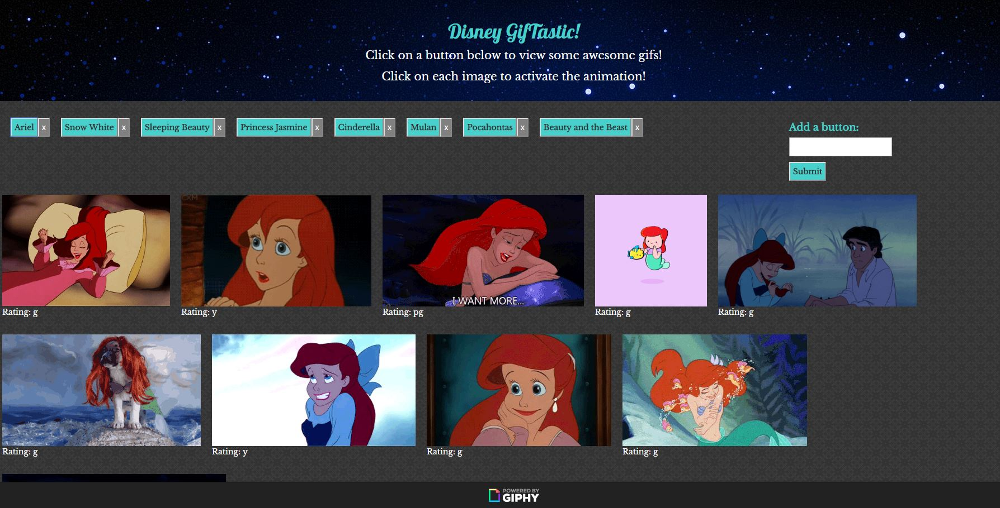

# GifTastic

## Overview

Uses the GIPHY API to make a dynamic web page that populates with gifs related to a subject of your choice. Uses GIPHY API and use JavaScript and jQuery to change the HTML of the site.

## Authors

* **Bethany Pfeister** 

## Acknowledgments

* UA Programming Bootcamp